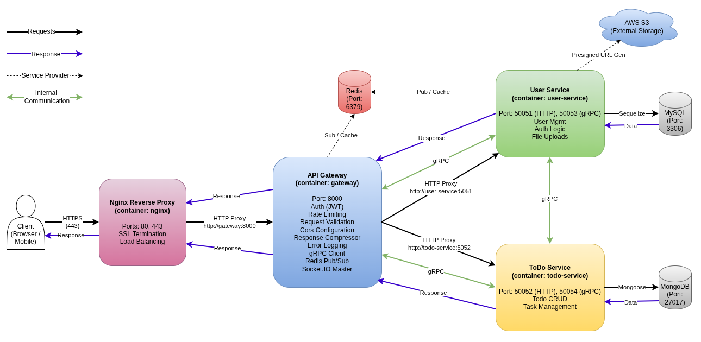

# 🚀 Enterprise Node.js Microservices Boilerplate

<div align="center">

**Production-Ready | Scalable | High-Performance | Docker-Native**

[](https://nodejs.org/)
[](https://www.docker.com/)
[](https://grpc.io/)
[](https://www.mysql.com/)
[](https://redis.io/)
[](https://nginx.org/)
[](https://socket.io/)
[](https://eslint.org/)
[](https://opensource.org/licenses/MIT)

*A comprehensive, production-ready microservices architecture for building **scalable**, **maintainable**, and **high-performance** backend applications with Node.js, gRPC, Docker, and modern DevOps practices.*

[Quick Start](#-quick-start) • [Architecture](#-architecture) • [Features](#-complete-feature-set) • [Documentation](#-documentation) • [API Reference](#-api-endpoints)

</div>

---

## 🎯 Overview

This repository provides a **battle-tested microservices architecture** with **best practices**, **production-grade patterns**, and **complete feature implementations** ready to scale from prototype to enterprise.

### 🌟 Why This Boilerplate?

- ✅ **Production-Ready** - Battle-tested patterns with comprehensive error handling
- ✅ **Microservices Architecture** - Loosely coupled, independently deployable services
- ✅ **gRPC Communication** - High-performance inter-service communication
- ✅ **Docker-Native** - Full containerization with Docker Compose orchestration
- ✅ **Real-time Support** - Socket.IO with Redis pub/sub for scalable WebSockets
- ✅ **Developer-Friendly** - Hot reload, comprehensive docs, easy to extend
- ✅ **Security-First** - JWT auth, rate limiting, CORS, Helmet, input validation
- ✅ **Performance Optimized** - Redis caching, connection pooling, distributed rate limiting

---

## 🏗️ Architecture

### High-Level Overview

```
┌──────────────────────────────────────────────────────────────────────┐
│                           CLIENT LAYER                               │
│  Web Browsers │ Mobile Apps │ Third-party APIs                       │
└───────────────────────────────┬──────────────────────────────────────┘
                                │ HTTPS (Port 8443/8080)
                                ↓
┌──────────────────────────────────────────────────────────────────────┐
│                       NGINX REVERSE PROXY                            │
│  ├── SSL Termination                                                 │
│  ├── Load Balancing                                                  │
│  ├── Static File Serving                                             │
│  └── Request Routing                                                 │
└───────────────────────────────┬──────────────────────────────────────┘
                                │ HTTP (Internal)
                                ↓
┌──────────────────────────────────────────────────────────────────────┐
│                       API GATEWAY (Express.js)                       │
│  ├── HTTP Request Handling                                           │
│  ├── Authentication/Authorization (JWT)                              │
│  ├── Rate Limiting (Redis-based)                                     │
│  ├── Request Proxying (http-proxy-middleware)                        │
│  ├── Socket.IO Server (Real-time)                                    │
│  ├── Static File Serving (/public)                                   │
│  └── gRPC Client (Service Communication)                             │
└───────────┬──────────────────┬────────────────────┬──────────────────┘
            │                  │                    │
            │ gRPC (50053)     │ Redis Pub/Sub      │
            │                  │                    │
    ┌───────▼──────┐    ┌──────▼───────┐     ┌──────▼───────┐
    │ USER SERVICE │    │    REDIS     │     │ TODO Service │
    │              │    │              │     │              │
    │ - Auth       │    │ - Caching    │     │ - Todo CRUD  │
    │ - Profiles   │    │ - Sessions   │     │ - Categories │
    │ - Files      │◄───┤ - Pub/Sub    │────►│ - Tags       │
    │ - gRPC Srv   │    │ - Rate Limit │     │ - Reminders  │
    └──────┬───────┘    └──────────────┘     └──────┬───────┘
           │                                        │
           │ Sequelize ORM             Mongoose ORM │
           ↓                                        ↓
    ┌──────────────┐                         ┌──────────────┐
    │    MySQL     │                         │    Mongo     │
    │   Database   │                         │   Database   │
    │              │                         │              │
    │ - Users      │                         │ - Todo       │
    │ - Sessions   │                         │ - Reminders  │
    └──────────────┘                         └──────────────┘
```


### Communication Patterns

<table>
<tr>
<td width="50%">

#### **External Communication (REST)**

**Use Case:** Client ↔ Backend

```
HTTP/HTTPS (Port 8080/8443)
  ├── RESTful APIs
  ├── JSON payload
  ├── JWT authentication
  └── Standard HTTP methods
```

**Perfect for:**
- Web/mobile app integration
- Third-party API access
- Public endpoints
- File uploads/downloads

</td>
<td width="50%">

#### **Internal Communication (gRPC)**

**Use Case:** Service ↔ Service

```
gRPC (Internal ports)
  ├── Protocol Buffers
  ├── Bidirectional streaming
  ├── Type-safe contracts
  └── High performance
```

**Perfect for:**
- Inter-service calls
- Real-time data sync
- Low-latency requirements
- Type-safe APIs

</td>
</tr>
<tr>
<td width="50%">

#### **Real-time Communication (WebSocket)**

**Use Case:** Server → Client push

```
Socket.IO (Port 8080/8443)
  ├── Bidirectional events
  ├── Room-based messaging
  ├── Automatic reconnection
  └── Redis pub/sub scaling
```

**Perfect for:**
- Live notifications
- Chat applications
- Real-time updates
- Collaborative features

</td>
<td width="50%">

#### **Event Broadcasting (Redis Pub/Sub)**

**Use Case:** Service → Gateway → Clients

```
Redis Pub/Sub (Internal)
  ├── Publish from services
  ├── Subscribe in gateway
  ├── Emit via Socket.IO
  └── Horizontal scaling
```

**Perfect for:**
- Cross-service events
- Distributed notifications
- Multi-instance sync
- Event-driven architecture

</td>
</tr>
</table>

---

## 🚀 Quick Start

### Prerequisites

- **Docker** (v20.10+)
- **Docker Compose** (v2.0+)
- **Node.js** (v20.x) - for local development
- **Git**

### 1️⃣ Clone Repository

```bash
git clone https://github.com/devendra-rajput/nodejs-microservice-boilerplate
cd nodejs-microservice-boilerplate
```

### 2️⃣ Configure Environment

```bash
# Copy environment template
cp services/.env.example services/.env.development

# Edit configuration (update DB credentials, JWT secrets, AWS keys, etc.)
nano services/.env.development
```

**Key Configuration:**
- `JWT_TOKEN_KEY` - Secret for JWT signing
- `USER_SERVICE_DB_*` - MySQL connection details
- `AWS_*` - AWS S3 credentials (for file uploads)
- `MAIL_*` - Email service configuration
- `CORS_ORIGINS` - Allowed origins for CORS

### 3️⃣ Build and Start Services

```bash
# Build images and start all services
docker-compose up --build

# Or run in detached mode (background)
docker-compose up -d --build
```

**Services Starting:**
- 🗄️ MySQL Database (Port 3307)
- 🔴 Redis (Port 6380)
- 🚪 API Gateway (Internal - Port 8000)
- 👤 User Service (2 replicas - Ports 50051, 50053)
- 🌐 Nginx (Ports 8080 HTTP, 8443 HTTPS)

### 4️⃣ Initialize Database

```bash
# Access user-service container
docker exec -it <user-service-container-name> sh

# Run migrations
npm run db:migrate

# (Optional) Run seeders
npm run db:seed
```

### 5️⃣ Verify Installation

**Health Check:**
```bash
curl http://localhost:8080/
# Response: "Gateway Server is running..."
```

**Access Points:**
```
🌐 API Base URL: http://localhost:8080
🔒 HTTPS URL: https://localhost:8443
🔌 Socket.IO: ws://localhost:8080
📁 Static Files: http://localhost:8080/public/
```

### 6️⃣ Test API

```bash
# Register a user
curl -X POST http://localhost:8080/user-service/api/v1/users/create \
  -H "Content-Type: application/json" \
  -d '{
    "email": "test@example.com",
    "password": "Test@123",
    "first_name": "John",
    "last_name": "Doe"
  }'

# Login
curl -X POST http://localhost:8080/user-service/api/v1/users/login \
  -H "Content-Type: application/json" \
  -d '{
    "email": "test@example.com",
    "password": "Test@123"
  }'
```

---

## 🛠️ Technology Stack

### Core Runtime & Framework
| Technology | Version | Purpose |
|------------|---------|---------|
| **Node.js** | 20.x | Runtime environment |
| **Express.js** | 5.x | Web framework (Gateway) |
| **Docker** | Latest | Containerization |
| **Docker Compose** | v2.x | Multi-container orchestration |
| **Nginx** | Alpine | Reverse proxy & load balancer |

### Inter-Service Communication
| Technology | Version | Purpose |
|------------|---------|---------|
| **gRPC** | ^1.14 | High-performance RPC |
| **Protocol Buffers** | ^0.8 | Service contracts |
| **http-proxy-middleware** | ^3.x | HTTP request proxying |

### Database & Caching
| Technology | Version | Purpose |
|------------|---------|---------|
| **MySQL** | 8.0 | Primary database |
| **Sequelize** | 6.x | MySQL ORM |
| **Redis** | Alpine | Caching, sessions, pub/sub |
| **ioredis** | ^5.9 | Redis client |

### Real-time & Events
| Technology | Version | Purpose |
|------------|---------|---------|
| **Socket.IO** | ^4.x | WebSocket server |
| **@socket.io/redis-adapter** | ^8.x | Multi-instance support |
| **Redis Pub/Sub** | - | Event broadcasting |

### Authentication & Security
| Technology | Version | Purpose |
|------------|---------|---------|
| **JWT** | ^9.0 | Token-based auth |
| **Bcryptjs** | ^3.0 | Password hashing |
| **Helmet** | ^8.x | Security headers |
| **CORS** | ^2.8 | Cross-origin control |
| **rate-limiter-flexible** | ^5.x | Distributed rate limiting |

### File Handling & Storage
| Technology | Version | Purpose |
|------------|---------|---------|
| **Multer** | ^2.0 | File upload middleware |
| **AWS S3 SDK** | ^3.x | Cloud storage integration |
| **HEIC Convert** | ^2.1 | Image format conversion |
| **UUID** | ^13.0 | Unique file naming |

### Utilities & Logging
| Technology | Version | Purpose |
|------------|---------|---------|
| **Winston** | ^3.19 | Structured logging |
| **winston-daily-rotate-file** | ^5.0 | Log rotation |
| **Nodemailer** | ^8.0 | Email service |
| **Moment-timezone** | ^0.6 | Timezone handling |
| **i18n** | ^0.15 | Internationalization |
| **Joi** | ^18.0 | Schema validation |

### Code Quality & DevOps
| Technology | Version | Purpose |
|------------|---------|---------|
| **ESLint** | ^9.x | Code linting |
| **Airbnb Base** | ^15.0 | Style guide |
| **eslint-plugin-security** | ^3.0 | Security checks |
| **Husky** | ^9.1 | Git hooks |
| **lint-staged** | ^16.2 | Pre-commit linting |
| **Nodemon** | ^3.1 | Development hot reload |

---

## 📦 Complete Feature Set

### ✅ Microservices Architecture Features

#### **API Gateway Service**
- ✅ Centralized entry point for all client requests
- ✅ HTTP request proxying to backend services
- ✅ JWT-based authentication middleware
- ✅ Distributed rate limiting (Redis-backed, per-IP)
- ✅ CORS configuration with allowed origins
- ✅ Security headers (Helmet)
- ✅ Request/response logging
- ✅ Static file serving (`/public` directory)
- ✅ Socket.IO server with authentication
- ✅ Redis adapter for horizontal scaling
- ✅ gRPC client for service communication
- ✅ Graceful shutdown handling
- ✅ Health check endpoints

#### **User Service (Microservice)**
- ✅ User registration with email verification
- ✅ Login/logout with JWT tokens
- ✅ Password reset flow with OTP
- ✅ Profile management (CRUD)
- ✅ Role-based access control (Admin, User)
- ✅ File upload (local & AWS S3)
- ✅ AWS S3 presigned URL generation
- ✅ Image format conversion (HEIC → JPG)
- ✅ Bulk file uploads
- ✅ gRPC server for inter-service calls
- ✅ MySQL database with Sequelize ORM
- ✅ Redis caching integration
- ✅ Email notifications (verification, password reset)
- ✅ Timezone-aware operations

### ✅ Real-time Communication Features

- ✅ **Socket.IO Integration**
  - WebSocket server in Gateway
  - JWT-based socket authentication
  - User-specific rooms (`user_{userId}`)
  - Event-driven architecture
  - Custom event handlers (extensible)

- ✅ **Redis Pub/Sub Pattern**
  - Backend services publish events to Redis
  - Gateway subscribes to Redis channels
  - Gateway emits to Socket.IO clients
  - Horizontal scaling support
  - Event routing to specific users/rooms

- ✅ **gRPC for Request/Response**
  - Client → Gateway → Service (via gRPC)
  - Type-safe service contracts
  - Immediate callback responses
  - Low-latency internal communication

### ✅ Security & Performance Features

- ✅ **Authentication & Authorization**
  - JWT access tokens (stateless)
  - Token expiration handling
  - Token mismatch detection
  - Active user validation via gRPC
  - Role-based access control

- ✅ **Rate Limiting & DDOS Protection**
  - Redis-based distributed rate limiter
  - Per-IP request tracking
  - Configurable points/duration
  - Automatic blocking (configurable)
  - Separate limits per endpoint (optional)

- ✅ **Caching Layer**
  - Redis caching for frequently accessed data
  - Automatic cache invalidation
  - TTL-based expiration
  - Connection pooling

- ✅ **Input Validation**
  - Joi schema validation
  - Request body sanitization
  - SQL injection prevention (ORM)
  - XSS protection

### ✅ File Management Features

- ✅ **Local File Storage** (Development)
  - Multer-based file uploads
  - Organized by date (`uploads/YYYY/M/D/`)
  - Unique filename generation (UUID + timestamp)
  - File type validation
  - Size limits enforcement
  - Volume mounting for persistence

- ✅ **AWS S3 Integration** (Production)
  - Direct S3 uploads via presigned URLs
  - Automatic file deletion
  - Public/private access control
  - Image format conversion (HEIC support)
  - Folder organization

### ✅ Production Features

- ✅ **Docker & Orchestration**
  - Multi-stage Dockerfiles
  - Docker Compose orchestration
  - Service replicas (2x Gateway, 2x User Service)
  - Health checks
  - Restart policies
  - Volume persistence
  - Network isolation

- ✅ **Development Experience**
  - Docker Compose Watch (file sync)
  - Hot reload with Nodemon
  - Automatic rebuild on package.json changes
  - ESLint with pre-commit hooks
  - Comprehensive error logging

- ✅ **Operational Excellence**
  - Graceful shutdown (SIGTERM, SIGINT)
  - Process signal handling
  - Connection cleanup
  - Daily log rotation (Winston)
  - Environment-based configuration
  - Timezone support
  - Internationalization (i18n)

---

## 📁 Project Structure

```
nodejs-microservice-boilerplate/
│
├── docker-compose.yml              # Multi-service orchestration
├── package.json                    # Root dependencies (linting)
├── eslint.config.mjs               # ESLint configuration
├── SOCKET_EVENTS_ARCHITECTURE.md   # Socket.IO architecture guide
│
├── protos/                         # Shared gRPC contracts
│   └── user.proto                  # User service protocol
│
├── nginx/                          # Reverse proxy configuration
│   ├── conf.d/                     # Nginx configs
│   │   └── default.conf            # Main routing config
│   └── certs/                      # SSL certificates
│       ├── nginx-selfsigned.crt
│       └── nginx-selfsigned.key
│
├── services/
│   ├── .env.example                # Environment template
│   ├── .env.development            # Development config
│   ├── .env.production             # Production config
│   │
│   ├── gateway/                    # API Gateway Service
│   │   ├── Dockerfile
│   │   ├── package.json
│   │   └── src/
│   │       ├── index.js            # Entry point
│   │       ├── bootstrap/          # Application initialization
│   │       │   ├── setup.js        # Express app setup
│   │       │   ├── routes.js       # Route configuration
│   │       │   ├── serverHandlers.js   # HTTP/HTTPS server
│   │       │   └── processHandlers.js  # Graceful shutdown
│   │       ├── config/
│   │       │   ├── cors.js         # CORS configuration
│   │       │   └── redis.js        # Redis client
│   │       ├── constants/
│   │       │   └── socket_events.js    # Socket event names
│   │       ├── grpc/
│   │       │   └── client.js       # gRPC client setup
│   │       ├── middleware/
│   │       │   ├── authorize.js    # JWT authentication
│   │       │   ├── rateLimiter.js  # Rate limiting
│   │       │   └── timezone.js     # Timezone handling
│   │       ├── public/             # Static files
│   │       │   └── css/
│   │       ├── services/
│   │       │   └── socket.js       # Socket.IO service
│   │       ├── tests/
│   │       │   ├── test-rate-limiter.js
│   │       │   └── test-multi-ip.js
│   │       ├── utils/
│   │       │   └── logger.js       # Winston logger
│   │       └── views/              # EJS templates
│   │           ├── layout.ejs
│   │           ├── terms.ejs
│   │           └── privacy.ejs
│   │
│   └── user-service/               # User Microservice
│       ├── Dockerfile
│       ├── package.json
│       ├── .sequelizerc            # Sequelize config
│       └── src/
│           ├── index.js            # Entry point
│           ├── bootstrap/          # Service initialization
│           ├── config/
│           │   ├── v1/
│           │   │   ├── database.js # MySQL config
│           │   │   └── redis.js    # Redis client
│           │   └── i18n.js         # Internationalization
│           ├── constants/
│           │   └── socket_events.js
│           ├── database/
│           │   ├── migrations/     # Sequelize migrations
│           │   └── seeders/        # Database seeders
│           ├── emailTemplates/
│           │   └── v1/
│           │       ├── verification.js
│           │       └── forgotPassword.js
│           ├── grpc/
│           │   ├── controllers/    # gRPC handlers
│           │   │   └── user.controller.js
│           │   └── server.js       # gRPC server setup
│           ├── helpers/
│           │   └── v1/
│           │       ├── data.helpers.js      # JWT, hashing, etc.
│           │       └── response.helpers.js  # API responses
│           ├── locales/            # i18n translations
│           │   └── en.json
│           ├── middleware/
│           │   ├── v1/
│           │   │   └── authorize.js
│           │   └── error.js
│           ├── models/             # Sequelize models
│           │   └── index.js
│           ├── resources/
│           │   └── v1/
│           │       └── users/
│           │           ├── user.model.js       # User model
│           │           ├── users.controller.js # HTTP handlers
│           │           └── users.validation.js # Joi schemas
│           ├── routes/             # Express routes
│           │   └── users.js
│           ├── services/
│           │   ├── aws.js          # AWS S3 integration
│           │   └── nodemailer.js   # Email service
│           ├── uploads/            # Local file storage (dev)
│           └── utils/
│               ├── logger.js       # Winston logger
│               └── upload.js       # Multer config
│
├── mysql_data_persistent/          # MySQL data volume (gitignored)
└── redis_data/                     # Redis data volume (gitignored)
```
---

## 🧪 Testing & Load Testing

### Rate Limiter Test (Single IP)

Tests rate limiting enforcement from a single IP address.

```bash
# Default: 250 RPS for 5 seconds
node services/gateway/src/tests/test-rate-limiter.js

# Custom configuration
node services/gateway/src/tests/test-rate-limiter.js \
  --base-url http://localhost:8080 \
  --rps 500 \
  --duration 10
```

**What it tests:**
- Request blocking after limit exceeded
- Rate limiter accuracy
- Response codes (200 vs 429)

### Multi-IP Test (Distributed)

Simulates traffic from multiple distinct IP addresses.

```bash
# Default: 10 users, 25 requests each
node services/gateway/src/tests/test-multi-ip.js

# Custom configuration
node services/gateway/src/tests/test-multi-ip.js \
  --base-url http://localhost:8080 \
  --users 20 \
  --requests 50
```

**What it tests:**
- Per-IP rate tracking
- Distributed rate limiting
- IP spoofing detection

### Apache Bench (ab)

```bash
# 10,000 requests with 100 concurrent connections
ab -n 10000 -c 100 http://localhost:8080/load-test
```

---

## 🔐 Security Features

### Authentication & Authorization

- ✅ **JWT-based authentication** - Stateless token validation
- ✅ **Token expiration** - Configurable token lifetime
- ✅ **Token mismatch detection** - Validates token against user record
- ✅ **Active user validation** - Ensures user exists and is active
- ✅ **Role-based access control** - Admin vs User permissions
- ✅ **Socket authentication** - JWT validation for WebSocket connections

### Input Validation & Sanitization

- ✅ **Joi schema validation** - All request bodies validated
- ✅ **SQL injection prevention** - Sequelize ORM (parameterized queries)
- ✅ **XSS protection** - Input sanitization (Helmet)
- ✅ **File type validation** - Whitelist-based file extensions
- ✅ **File size limits** - Configurable upload limits

### Network Security

- ✅ **CORS configuration** - Allowed origins whitelist
- ✅ **Helmet security headers** - XSS, clickjacking, etc.
- ✅ **Trusted proxy** - IP spoofing prevention
- ✅ **Rate limiting** - Redis-based distributed limiting (per-IP)
- ✅ **SSL/TLS** - HTTPS support via Nginx

### Data Security

- ✅ **Password hashing** - Bcrypt with salt rounds
- ✅ **Environment variables** - Sensitive data in .env files
- ✅ **Secrets management** - JWT keys, DB passwords, API keys
- ✅ **Database encryption** - MySQL native encryption (optional)

### Code Security

- ✅ **ESLint security plugin** - Detects unsafe patterns
  - ReDoS (regex denial of service)
  - `eval()` usage
  - Child process misuse
  - Object injection
- ✅ **Dependency scanning** - Regular `npm audit` checks
- ✅ **Git hooks** - Pre-commit security checks

---

## 🧹 Code Quality & Linting

This project uses **ESLint** with **Airbnb Base** style guide and **eslint-plugin-security** to ensure code quality and security.

### Features

- ✅ **Airbnb Base**: Industry-standard JavaScript best practices
- ✅ **Security Plugin**: Vulnerability detection (ReDoS, eval, etc.)
- ✅ **Flat Config**: Modern ESLint configuration (eslint.config.mjs)
- ✅ **Auto-fix**: Automatically fix formatting issues
- ✅ **Git Hooks**: Pre-commit linting via Husky + lint-staged

### Running Linter

```bash
# Check for issues
npm run lint

# Auto-fix issues
npm run lint:fix
```

### Pre-commit Hooks

**Husky** and **lint-staged** automatically run ESLint on staged files before every commit.

```bash
# What happens on git commit:
git add .
git commit -m "Your message"

# → Husky triggers lint-staged
# → ESLint runs on staged .js files
# → Auto-fixes applied
# → If unfixable errors exist, commit is BLOCKED
```

**Configuration:**
```json
{
  "lint-staged": {
    "services/**/*.js": "eslint --fix"
  }
}
```

---

## 📈 Scaling & Production Deployment

### Horizontal Scaling

Adjust service replicas in `docker-compose.yml`:

```yaml
services:
  user-service:
    deploy:
      replicas: 5  # Run 5 instances

  gateway:
    deploy:
      replicas: 3  # Run 3 Gateway instances
```

### Load Balancing

**Nginx** handles load balancing for the Gateway:

```nginx
upstream gateway {
    least_conn;  # Load balancing algorithm
    server gateway:8000 max_fails=3 fail_timeout=30s;
}
```

**Redis adapter** handles load balancing for Socket.IO across Gateway replicas.

### Production Checklist

- [ ] Set `NODE_ENV=production`
- [ ] Use `.env.production` with real secrets
- [ ] Enable real SSL certificates (Let's Encrypt)
- [ ] Configure real MySQL database (AWS RDS, etc.)
- [ ] Set up Redis cluster (AWS ElastiCache, etc.)
- [ ] Configure AWS S3 for file storage
- [ ] Set up email service (SendGrid, AWS SES, etc.)
- [ ] Enable database backups
- [ ] Set up CI/CD pipelines
- [ ] Run security audits (`npm audit`)
- [ ] Load test your application
- [ ] Configure CORS for your domain
- [ ] Set appropriate rate limits

---

## 🐳 Docker Commands

### Basic Operations

```bash
# Start services
docker-compose up

# Start in background
docker-compose up -d

# Build and start
docker-compose up --build

# Stop services
docker-compose down

# View logs
docker-compose logs -f

# View specific service logs
docker-compose logs -f gateway
docker-compose logs -f user-service
```

### Service Management

```bash
# Restart a service
docker-compose restart user-service

# Scale a service
docker-compose up --scale user-service=3

# Rebuild a specific service
docker-compose up --build user-service
```

### Debugging

```bash
# List running containers
docker ps

# Access container shell
docker exec -it <container-name> sh

# View container logs
docker logs -f <container-name>

# Inspect container
docker inspect <container-name>
```

### Cleanup

```bash
# Stop and remove containers
docker-compose down

# Remove containers and volumes
docker-compose down -v

# Remove images
docker-compose down --rmi all

# Prune unused resources
docker system prune -a
```

---

## 📚 Documentation

### Main Documentation
- **README** (this file) - Complete overview

### Service Documentation
- **Gateway Service** - [services/gateway/README.md](./services/gateway/README.md) (if exists)
- **User Service** - [services/user-service/README.md](./services/user-service/README.md) (if exists)

### Configuration Files
- **Docker Compose** - [docker-compose.yml](./docker-compose.yml)
- **Nginx Config** - [nginx/conf.d/default.conf](./nginx/conf.d/default.conf)
- **ESLint Config** - [eslint.config.mjs](./eslint.config.mjs)
- **Proto Definitions** - [protos/user.proto](./protos/user.proto)

---

## 🤝 Contributing

We welcome contributions! Here's how:

### 1. Fork & Clone

```bash
git clone https://github.com/YOUR_USERNAME/nodejs-microservice-boilerplate
cd nodejs-microservice-boilerplate
```

### 2. Create Feature Branch

```bash
git checkout -b feature/amazing-feature
```

### 3. Make Changes

- Follow the existing code structure
- Add tests if applicable
- Update documentation
- Ensure ESLint passes (`npm run lint`)

### 4. Commit Changes

```bash
git add .
git commit -m "feat: Add amazing feature"
```

**Commit Message Guidelines:**
- `feat:` New feature
- `fix:` Bug fix
- `docs:` Documentation changes
- `refactor:` Code refactoring
- `test:` Test additions/changes
- `chore:` Build/config changes

### 5. Push & Create PR

```bash
git push origin feature/amazing-feature
```

Then create a Pull Request on GitHub.

### Code of Conduct

- Write clean, maintainable code
- Follow existing patterns and conventions
- Add comments for complex logic
- Test your changes thoroughly
- Be respectful and collaborative

---

## 🗺️ Roadmap

### Planned Features

- [ ] **Additional Services**
  - Todo Service (MongoDB + Mongoose)
  - Notification Service

- [ ] **Enhanced Features**
  - OAuth2 integration (Google, GitHub, etc.)
  - Two-factor authentication (2FA)
  - API versioning strategy

- [ ] **DevOps & Monitoring**
  - Kubernetes deployment configs
  - CI/CD pipelines (GitHub Actions)

- [ ] **Documentation**
  - API documentation (Swagger/OpenAPI)
  - Architecture diagrams
  - Development guides
  - Deployment guides

---

## 📄 License

This project is licensed under the MIT License - see the [LICENSE](LICENSE) file for details.

---

## 🙏 Acknowledgments

- Built with ❤️ using **Node.js**, **Docker**, **gRPC**, and **microservices architecture**
- Inspired by **Netflix**, **Uber**, and **Amazon** microservices patterns
- Designed for developers who value **scalability**, **performance**, and **clean architecture**
- Optimized for **production use** with real-world best practices

---

## 👤 Author

**Devendra Kumar** (Dev Rajput)  
Full-Stack Developer | Microservices Architect

- 📧 Email: developer@devrajput.in
- 🌐 Portfolio: [www.devrajput.in](https://www.devrajput.in)
- 💼 LinkedIn: [devendra-kumar](https://www.linkedin.com/in/devendra-kumar-3ba793a7)
- 🐙 GitHub: [devendra-rajput](https://github.com/devendra-rajput)

---

## 📞 Support

- 📧 **Email**: developer@devrajput.in
- 🐛 **Issues**: [GitHub Issues](https://github.com/devendra-rajput/nodejs-microservice-boilerplate/issues)
- 💬 **Discussions**: [GitHub Discussions](https://github.com/devendra-rajput/nodejs-microservice-boilerplate/discussions)
- 📚 **Documentation**: See files listed in [Documentation](#-documentation) section

---

<div align="center">

### 🌟 **Star this repo if you find it helpful!** 🌟

---

**Built with** ⚡ Node.js | 🐳 Docker | 🔗 gRPC | 🚀 Microservices

**Powered by** Redis, MySQL, Socket.IO, Nginx, and modern DevOps practices

---

## 🚀 Ready to Build Something Amazing?

[⬆ Back to Top](#-enterprise-nodejs-microservices-boilerplate)

</div>
